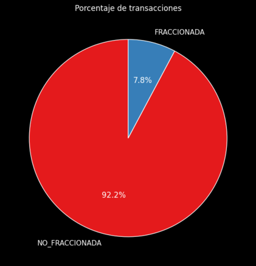
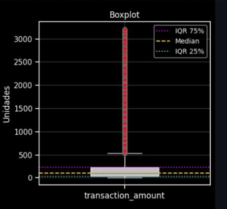

# Prueba Técnica: Detección de Fraccionamiento Transaccional

Este documento describe el proceso seguido para **explorar** los datos, **identificar** variables relevantes y **definir** un modelo/heurístico para detectar la práctica del **Fraccionamiento Transaccional**, entendida como la división de una transacción grande en varias más pequeñas dentro de una misma ventana de 24 horas.

---

## Tabla de Contenido
1. [Introducción](#introducción)  
2. [Objetivo](#objetivo)  
3. [Alcance y Definiciones](#alcance-y-definiciones)  
4. [Exploración y Evaluación de Datos (EDA)](#exploración-y-evaluación-de-datos-eda)  
   - [Calidad de Datos](#calidad-de-datos)  
   - [Estadísticos Descriptivos](#estadísticos-descriptivos)  
   - [Hipótesis Iniciales](#hipótesis-iniciales)  
5. [Definición del Modelo Analítico](#definición-del-modelo-analítico)  
   - [Flujo de Datos](#flujo-de-datos)
   - [Criterio de Selección del Modelo Analítico](#criterio-de-selección-del-modelo-analítico)
   - [Lógica de Fraccionamiento](#lógica-de-fraccionamiento)  
   - [Frecuencia de Actualización](#frecuencia-de-actualización)  
   - [Arquitectura Ideal](#arquitectura-ideal)
6. [Resultados](#resultados)
   - [Distribución global de transacciones](#distribución-global-de-transacciones)
   - [Densidad de montos promedios](#densidad-de-montos-promedios)
   - [Transacciones fraccionadas por día de la semana](#transacciones-fraccionadas-por-día-de-la-semana)
   - [Heatmap día vs hora (transacciones fraccionadas)](#heatmap-día-vs-hora-(transacciones-fraccionadas))
   - [Porcentaje de transacciones fraccionadas por tipo](#porcentaje-de-transacciones-fraccionadas-por-tipo)
   - [Top 10 usuarios con más transacciones fraccionadas](#top-10-usuarios-con-más-transacciones-fraccionadas)
7. [Conclusiones y Próximos pasos](#conclusiones-y-próximos-pasos)

---

## Introducción
En el marco de la prueba técnica, se facilita un conjunto de datos (dataset) que contiene información de transacciones financieras. El desafío consiste en **detectar** la mala práctica de **Fraccionamiento Transaccional**, donde un usuario (o cuenta) realiza múltiples transacciones de menor valor que, agrupadas en una ventana de 24 horas, equivalen o superan una supuesta “transacción original”.

---

## Objetivo
1. **Identificar** patrones de fraccionamiento transaccional en el dataset provisto.
2. **Describir** el proceso analítico, desde la exploración de datos (EDA) hasta la propuesta de modelo o reglas.  
3. **Proveer** una recomendación sobre la frecuencia de actualización y, opcionalmente, diseñar una arquitectura para desplegar la solución.

---

## Alcance y Definiciones
- **Fraccionamiento Transaccional**: Práctica de dividir un monto grande en varios montos pequeños dentro de un lapso de 24 horas, con la misma cuenta o el mismo usuario.
- **Ventana de Tiempo (24 horas)**: Período en el cual se evalúa la suma y el conteo de transacciones para identificar la fracción de un monto mayor.

### Columnas relevantes
- **`_id`**: Identificador único del registro.
- **`merchant_id`**: Código único del comercio o aliado.
- **`subsidiary`**: Código único de la sede o sucursal.
- **`transaction_date`**: Fecha de transacción en el core financiero.
- **`account_number`**: Número único de cuenta.  
- **`user_id`**: Código único del usuario dueño de la cuenta desde donde se registran las transacciones.
- **`transaction_amount`**: Monto de la transacción (en moneda ficticia).
- **`transaction_type`**: Naturaleza de la transacción (crédito o débito).

---

## Exploración y Evaluación de Datos (EDA)
Durante esta fase, se realizaron **descriptivos** y **validaciones** de calidad para comprender el comportamiento de las transacciones.

### Muestreo de los Datos
Se trabajó con una muestra correspondiente al 10% del tamaño de los datasets originales.

### Calidad de Datos
1. **Valores Nulos / Faltantes**  
   - No se identificó valores nulos a nivel de registro.

2. **Duplicados**  
   - Al analizar la **relación** entre `user_id` y `account_number`, no se cumple la condición de 1:1.
        - Es decir, un mismo `account_number` puede estar asociado a varios `user_id`, reflejando cuentas compartidas o varios autorizados sobre una sola cuenta. 
        - Esta situación no se considera un “duplicado” tradicional, pero sí indica que distintas personas (o identificadores) podrían usar la misma cuenta, lo cual puede influir en el análisis de fraccionamiento (p. ej., hay que decidir si se agrupa por usuario o por cuenta, o por ambos).

3. **Consistencia en fechas**
   - Rango de fechas plausible (ej.: desde 2021-01-01 hasta 2021-11-30, sin fechas futuras ni inválidas).

### Estadísticos Descriptivos
- **Montos (`transaction_amount`)**  
  - Mínimo: 5.94  
  - Máximo: ~3,210  
  - Media: ~191
  - Mediana: 107  
  - Desviación Estándar: ~241

- **Distribución por tipo (`transaction_type`)**  
  - 80% Débito  
  - 20% Crédito

#### Visualizaciones
- **Histograma**
   - La mayoría de las transacciones tienen montos bajos (concentradas cerca de 0).
   - Pocas transacciones tienen montos altos, lo que genera una larga cola hacia la derecha.



- **Boxplot**
   - La gran cantidad de valores atípicos sugiere que el conjunto de datos tiene muchas transacciones poco comunes con montos elevados.
   - La mediana está cerca del límite inferior de la caja, lo que refuerza que la mayoría de los datos están concentrados en valores bajos.



### Hipótesis Iniciales
1. **Fraccionamiento por conteo**: Si un usuario hace más de 2 transacciones pequeñas en 24h, podría ser considerado como fraccionamiento.
2. **Mismo Usuario / Cuenta**: Se asume que las transacciones deben compartir `user_id` o `account_number` para considerarse parte del mismo fraccionamiento.

---

## Definición del Modelo Analítico

### Flujo de Datos
1. **Ingesta**  
   - Se reciben los datos en cualquier tipo de formato (p. ej. parquet, csv, etc).
2. **Preprocesamiento**  
   - Limpieza, formateo de fechas, eliminación de registros duplicados, entre otros.
3. **Generación de Atributos (Features)**  
   - Conteo de transacciones en 24h, suma de montos, etc.
4. **Aplicación de la Lógica (Regla de negocios)**  
   - Se etiquetan las transacciones como “fraccionadas” o “no fraccionadas” según la ventana de 24h.
5. **Salida**  
   - Creación de un flag (`fraction_flag`) para cada transacción.

### Criterio de Selección del Modelo Analítico
El **modelo analítico** propuesto consiste en la **evaluación de transacciones** dentro de una **ventana rodante de 24 horas** y la aplicación de una **regla heurística** (conteo de transacciones en ese lapso). A continuación, se describe el **porqué** de esta selección:

1. **Simplicidad e Interpretabilidad**  
   - Al basarse en una regla de conteo (por ejemplo, “si hay *n* transacciones en 24 horas, marcar fraccionamiento”), es **fácil de entender y explicar** para el equipo de negocio, auditoría o cumplimiento.  
   - No requiere conocimientos avanzados de estadísticas o machine learning; además, **las alertas generadas** son trazables a un criterio claro.

2. **Rapidez de Implementación**  
   - Los **umbrales** (número mínimo de transacciones o sumas de montos) se pueden ajustar rápidamente con base en la experiencia de negocio.  
   - El código puede implementarse en `pandas`, `SQL` o un motor de reglas sin una curva de aprendizaje compleja.

3. **Escalabilidad**  
   - Aunque en un escenario de alto volumen podría requerirse optimización (Spark, Dask, etc.), la **idea principal** (ventanas de 24h, conteo de transacciones) es sencilla de escalar.  
   - También es **fácil de trasladar** a soluciones de streaming o batch según la necesidad.

4. **Modelos más sofisticados**
   - Esta **regla heurística** puede servir como **base** para luego implementar enfoques de Machine Learning (como detección de anomalías) o modelos estadísticos más avanzados.  
   - Permite crear un **punto de partida** e iterar en la medida que la organización requiera mayor precisión o menos falsos positivos.

En síntesis, se eligió un **modelo heurístico** y **reglas de negocio** por su **clara interpretabilidad, bajo costo de implementación** y **alineación con las definiciones de fraccionamiento transaccional** (ventanas de 24 horas, número mínimo de transacciones), lo que facilita la **adopción y validación** en entornos de cumplimiento o auditoría.

### Lógica de Fraccionamiento
- **Ventana**: `[t - 24h, t]` para cada transacción.  
- **Criterio**:  
  - Si en esa ventana hay >= 2 transacciones (puede ajustarse a 3, 4, etc.), marcar como **fraccionada**.

```python
# Función que aplica las reglas de negocio
def check_fraccionamiento_24h(user_df, min_count=2):
    times = user_df['transaction_date'].values
    flags = list()
    for i in range(len(times)):
        current_time = times[i]
        window_mask = (
            (times >= current_time - np.timedelta64(24, 'h')) & 
            (times <= current_time)
        )
        window_sub = user_df[window_mask]
        count_tx = len(window_sub)
        
        if count_tx >= min_count:
            flags.append(True)
        else:
            flags.append(False)
            
    return flags

# 1) Ordenar el DataFrame
data = data.sort_values(by=['user_id', 'transaction_date'])

# 2) Generar el array de valores booleanos sin asignarlos al DataFrame todavía
bool_flags = (
    data
    .groupby('user_id', group_keys=False)
    .apply(lambda df: check_fraccionamiento_24h(df, min_count=2))
    .explode()        # Separa la lista booleana por filas
    .astype(bool)     # Asegurarnos de que sea tipo bool
    .values           # Convertir a array de numpy
)

# 3) Crear directamente la columna de texto 'fraction_flag'
data['fraction_flag'] = np.where(
    bool_flags,
    'FRACCIONADA', 
    'NO_FRACCIONADA'
)
```

### Frecuencia de Actualización
Dado el **caso de estudio** y las consideraciones previas (ventaja de simplicidad vs. inmediatez en la detección), se sugiere un **enfoque híbrido** que equilibre la rapidez de respuesta y la factibilidad técnica:

1. **Ejecución diaria (batch) como base**  
   - A nivel **operativo**, se programa una corrida cada noche para consolidar y analizar todas las transacciones del día, marcando aquellas que cumplan con los criterios de fraccionamiento.  
   - **Ventajas**:
     - Implica **menor complejidad** de desarrollo e infraestructura.
     - Ofrece un **análisis exhaustivo** con la ventana de 24 horas completa y cerrada.

2. **Alertas en tiempo casi real (Streaming) para casos críticos**  
   - Si se requiere actuar sobre **montos muy altos** o ciertos indicadores de riesgo, implementar **reglas de streaming** enfocadas solo en **eventos de alto impacto**.  
   - **Ventajas**:
     - Evita la necesidad de procesar absolutamente todas las transacciones en streaming.
     - Permite **detección inmediata** de situaciones realmente críticas (p. ej., muchas transacciones en minutos consecutivos, sumas muy elevadas, etc.).

#### Justificación

- **Coste y Complejidad**: Un sistema 100% en streaming puede resultar costoso e innecesario si la mayoría de casos no requieren respuesta inmediata.  
- **Rapidez de Implementación**: Al tener un proceso batch como núcleo, el desarrollo inicial es más sencillo y estable.  
- **Análisis Integral**: La corrida nocturna garantiza un **reporte completo** de fraccionamientos para todo el día, que puede revisarse por áreas de cumplimiento o riesgo.  
- **Escalabilidad**: En caso de que aparezcan más casos urgentes o se exija una respuesta aún más rápida, se pueden **ampliar** gradualmente las reglas de streaming.

En conclusión, se puede combinar un **proceso batch diario** con una **capa de streaming** enfocada en eventos de riesgo alto, maximizando la relación **costo–beneficio** y proporcionando, a la vez, la **reacción inmediata** en los escenarios más críticos.

### Arquitectura Ideal
### 1. Data Lake (Amazon S3)
- **Almacenamiento** de todas las transacciones en formato **CSV** o **Parquet**.
- **Punto central** donde se depositan los datos tanto de ingestas diarias (batch) como de flujos en tiempo real (opcionalmente, usando Kinesis Firehose).

---

### 2. ETL Batch con AWS Glue
- **AWS Glue**  
  - Descubrimiento de datos y ejecución de scripts ETL en modo serverless.  
  - Limpieza, normalización y consolidación de transacciones.
- **Planificación Diaria**  
  - Se programa una corrida (por ejemplo, cada noche) para generar un dataset “enriquecido”, aplicando **reglas heurísticas** (ventana de 24 horas, número mínimo de transacciones).  
  - Las transacciones etiquetadas como “fraccionadas” o “no fraccionadas” se guardan en un nuevo conjunto de datos.

---

### 3. Componente de Streaming (Amazon Kinesis + AWS Lambda)
- **Amazon Kinesis**  
  - Recibe transacciones en tiempo cercano.  
  - Puede integrarse con **Kinesis Data Firehose** para volcar datos a S3 o con **Kinesis Data Analytics** si se necesita mayor procesamiento.
- **AWS Lambda**  
  - Funciones serverless que aplican **la misma regla heurística** en tiempo real.  
  - Por ejemplo, cada evento se evalúa: “¿Cuántas transacciones realizó este `user_id` en las últimas 24h?”  
  - De detectar un fraccionamiento inminente, **Lambda** puede emitir una alerta (SNS, correo, etc.) o marcar la transacción como “fraccionada” instantáneamente.
- **Envío a S3**  
  - Kinesis Firehose, tras etiquetar los datos, puede guardarlos de nuevo en **Amazon S3**, alimentando así el pipeline batch con información actualizada.

---

### 4. Almacenamiento y Consulta (Amazon Redshift)
- **Consolidación**  
  - Cargar las transacciones ya etiquetadas (batch + streaming) en **Amazon Redshift**.  
  - Permite realizar análisis históricos, comparaciones de tendencias, etc.
- **Consultas Analíticas**  
  - Mediante SQL de alto rendimiento, se exploran patrones de fraccionamiento, frecuencia de usuarios, etc.

---

### 5. Business Intelligence (Amazon QuickSight)
- **Visualización**  
  - Conectarse a **Redshift** para crear dashboards sobre la actividad de fraccionamiento (número de transacciones en 24h, top usuarios, etc.).
- **Alertas e Indicadores**  
  - Configurar paneles que muestren las transacciones marcadas como “fraccionadas”, generando insights para el equipo de riesgo o cumplimiento.

---
## Resultados

1. **Distribución global de transacciones**:

- La gráfica circular revela que aproximadamente 7.8% de las transacciones se clasifican como FRACCIONADAS, frente al 92.2% que no lo están. Esto indica que el fraccionamiento, si bien no es mayoritario, no es un fenómeno despreciable y vale la pena monitorearlo.

2. **Densidad de montos promedios**
- Al comparar las distribuciones de montos “fraccionados” vs. “no fraccionados”, se observa que las transacciones marcadas como FRACCIONADAS tienden a concentrarse en rangos de menor valor (promedio cercano a 122), mientras las “no fraccionadas” exhiben montos más altos (promedio alrededor de 197).
- Esto sugiere que los usuarios podrían dividir transacciones grandes en varias de menor importe para evadir controles, alineándose con la lógica de fraccionamiento.

3. **Transacciones fraccionadas por día de la semana**
- El gráfico circular y la respectiva gráfica de barras muestran que los días Tuesday (16.2%) y Wednesday (15.7%) destacan con más transacciones fraccionadas, seguidos por Thursday, Friday y Saturday en porcentajes no muy lejanos.
- El día Sunday (10.6%) es el de menor incidencia de fraccionamiento, aunque no hay un día “libre” de este comportamiento.

4. **Heatmap día vs. hora (transacciones fraccionadas)**
- El mapa de calor confirma que hay picos de actividad fraccionada a media mañana y primeras horas de la tarde (entre 9:00 y 16:00, aproximadamente), concentrados sobre todo entre martes y viernes.
- Esto indica que los usuarios suelen fraccionar transacciones en horarios laborales o comerciales.

5. **Porcentaje de transacciones fraccionadas por tipo**
- La barra horizontal refleja que cerca de 64.6% de las operaciones fraccionadas son débito, y el 35.4% restante son crédito.
- Esto coincide con un posible patrón de retiros o pagos fraccionados, aunque no se descarta la práctica en créditos.

6. **Top 10 usuarios con más transacciones fraccionadas**
- La visualización final ubica a ciertos usuarios (identificados por su `user_id`) como los principales responsables de un número elevado de transacciones fraccionadas, superando los 600 eventos en algunos casos.
- Estos perfiles son los principales candidatos a ser investigados o monitoreados por los equipos de riesgo.

--- 
## Conclusiones y próximos pasos

1. **Implementación**  
   - Se comprobó que la heurística basada en la ventana de 24 horas identifica posibles fraccionamientos de forma clara y comprensible.  
   - No obstante, resulta fundamental **validar umbrales** (por ejemplo, `min_count`) con datos históricos y conocimiento experto del negocio para reducir falsos positivos o falsos negativos.

2. **Trazabilidad**  
   - Mantener un registro detallado de las **transformaciones** y **reglas** aplicadas (por ejemplo, en un repositorio de versiones o un documento de políticas de cumplimiento).  
   - Esto facilita auditorías y revisiones posteriores, especialmente si la detección de fraccionamiento tiene **implicaciones legales o regulatorias**.

3. **Monitoreo**  
   - Una vez en producción, monitorear la **efectividad** de la detección:
     - ¿Cuántos casos son verdaderos positivos vs. cuántos falsos?  
     - ¿En qué escenarios se generan alertas innecesarias?  
   - Con esta retroalimentación, ajustar parámetros (número mínimo de transacciones, posible umbral de montos) o incorporar más características relevantes.

4. **Escalabilidad**  
   - La **arquitectura** propuesta (Data Lake, ETL, Motor de Reglas/ML, Data Warehouse/BI) permite crecer en complejidad:
     - Empezar con un enfoque **batch** y, si es necesario, evolucionar a **streaming** para detectar casos críticos en tiempo real.  
     - Integrar algoritmos de detección de anomalías o Machine Learning avanzado si se requiere una **detección más sofisticada**.

5. **Próximos Pasos**  
   - **Optimizar el pipeline**: refinar la construcción de ventanas (posibles mejoras en manejo de fechas, segmentación por tipo de transacción, etc.).  
   - **Evaluar Integraciones**: con sistemas de notificaciones o dashboards para accionabilidad inmediata.
   - **Automatizar Alertas**: configurar reglas de negocio que notifiquen automáticamente al equipo de riesgo cuando se superen ciertos umbrales críticos.